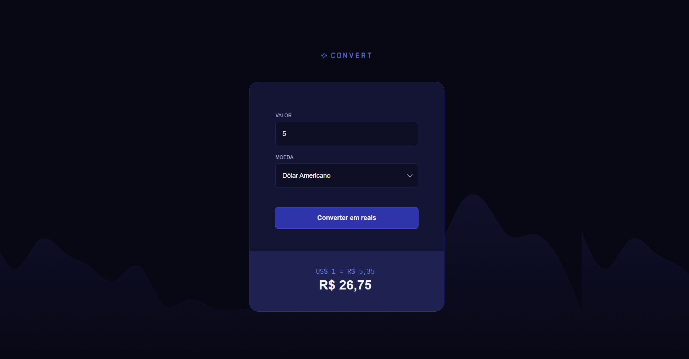

# Convert


*Preview da interface do conversor de moedas.*

Projeto desenvolvido como parte do curso **Full-Stack da Rocketseat**, com foco no estudo de **JavaScript**, **HTML5** e **CSS3**, aplicando lógica de programação e manipulação do DOM para criação de uma funcionalidade interativa.


## Tecnologias Utilizadas
- **HTML5**
- **CSS3**
- **JavaScript**


## Objetivo do Projeto
O objetivo deste projeto é praticar a construção de um **conversor de moedas**, aplicando conceitos fundamentais de **JavaScript**, como manipulação do DOM, tratamento de eventos, lógica condicional e atualização dinâmica de dados na interface.

O projeto simula uma funcionalidade comum em aplicações reais, com foco em clareza de código, organização e experiência do usuário.


## Como visualizar o projeto

### 1. Clone o repositório
```bash
git clone https://github.com/muddyorc/convert.git
